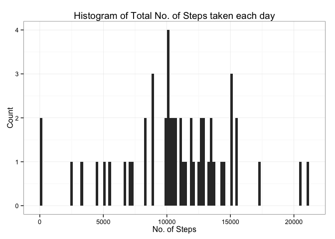
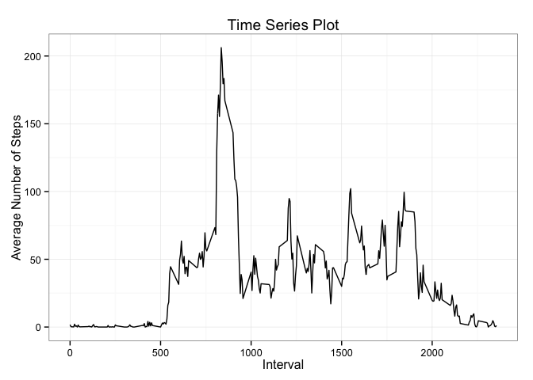
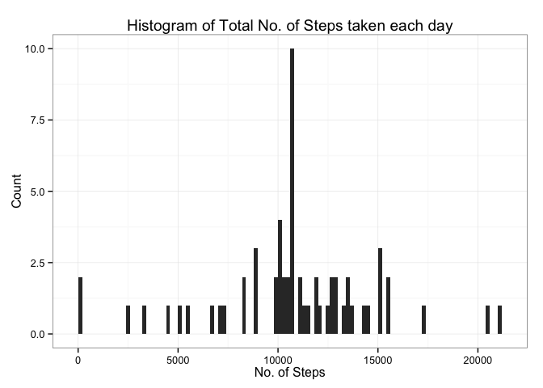
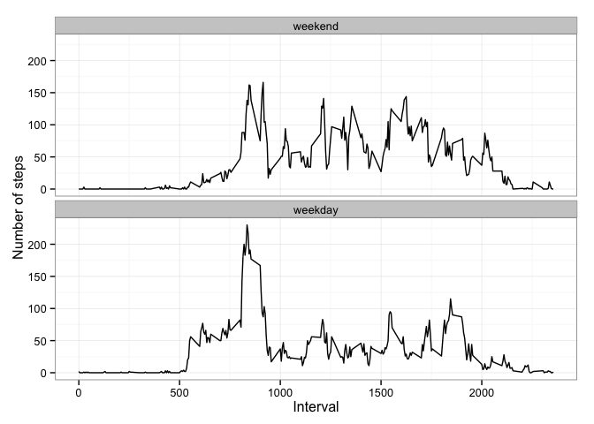

# Reproducible Research: Peer Assessment 1


## Loading and preprocessing the data

1.Load the data (i.e. read.csv())


```r
data <- read.csv("activity.csv")
```

2.Process/transform the data (if necessary) into a format suitable for your analysis

```r
data$date <- as.Date(data$date,format="%Y-%m-%d")
str(data)
```

```
## 'data.frame':	17568 obs. of  3 variables:
##  $ steps   : int  NA NA NA NA NA NA NA NA NA NA ...
##  $ date    : Date, format: "2012-10-01" "2012-10-01" ...
##  $ interval: int  0 5 10 15 20 25 30 35 40 45 ...
```

## What is mean total number of steps taken per day?

1.Make a histogram of the total number of steps taken each day

```r
library("ggplot2","stats")
data_complete <- data[complete.cases(data),]
data_bydate <- split(data_complete,data_complete$date)
steps_bydate <- sapply(data_bydate,function(x) sum(x$steps))
steps_bydate_df <- as.data.frame(steps_bydate)

g1 <- ggplot(steps_bydate_df, aes(x=steps_bydate)) + 
        geom_histogram(binwidth=200) +
        labs (title="Histogram of Total No. of Steps taken each day", 
              x="No. of Steps", 
              y= "Count") + 
        theme_bw()
print(g1)
```

 

2.Calculate and report the mean and median total number of steps taken per day


```r
mean_steps <- mean(steps_bydate)
median_steps <- median(steps_bydate)
```
        Mean : 10766.19

        Median : 10765

## What is the average daily activity pattern?


1.Make a time series plot (i.e. type = "l") of the 5-minute interval (x-axis) and the average number of steps taken, averaged across all days (y-axis)


```r
data_byinterval <- split(data_complete,data_complete$interval)
steps <- sapply(data_byinterval, function(x) mean(x$steps))
steps_byinterval_df <- as.data.frame(steps)
steps_byinterval_df$interval <- as.integer(attr(steps_byinterval_df, "row.names"))
steps_byinterval_df$steps <- as.numeric(steps_byinterval_df$steps)

g2 <- ggplot(steps_byinterval_df, aes(x=interval,y=steps)) + 
        geom_line() + 
        labs(title="Time Series Plot", 
             x="Interval", 
             y= "Average Number of Steps") + 
        theme_bw()
print(g2)
```

 

2.Which 5-minute interval, on average across all the days in the dataset, contains the maximum number of steps?


```r
answer <- steps_byinterval_df[steps_byinterval_df$steps %in% max(steps_byinterval_df$steps),]$interval
```
        
        5 minute interval with maximum number of steps : 835

## Imputing missing values

Note that there are a number of days/intervals where there are missing values (coded as NA). The presence of missing days may introduce bias into some calculations or summaries of the data.

1.Calculate and report the total number of missing values in the dataset (i.e. the total number of rows with NAs)


```r
missing_values <- nrow(data) - nrow(data_complete)
```
        
        Total number of rows with NAs : 2304

2.Devise a strategy for filling in all of the missing values in the dataset. The strategy does not need to be sophisticated. For example, you could use the mean/median for that day, or the mean for that 5-minute interval, etc.

     Strategy : Impute with the mean for that 5 minute interval.  

3.Create a new dataset that is equal to the original dataset but with the missing data filled in.


```r
data_imp <- merge(data,steps_byinterval_df,by="interval")
data_imp[is.na(data_imp$steps.x),]$steps.x <- data_imp[is.na(data_imp$steps.x),]$steps.y
data_imp$steps.y <- NULL
names(data_imp) <- c("interval","steps","date")
```

        Answer : data_imp is the the dataframe with the missing data(NA) filled in.
        
4.Make a histogram of the total number of steps taken each day and Calculate and report the mean and median total number of steps taken per day. Do these values differ from the estimates from the first part of the assignment? What is the impact of imputing missing data on the estimates of the total daily number of steps?


```r
data_imp_bydate <- split(data_imp,data_imp$date)
steps_imp_date <- sapply(data_imp_bydate,function(x) sum(x$steps))
steps_imp_date_df <- as.data.frame(steps_imp_date)
g3 <- ggplot(steps_imp_date_df, aes(x=steps_imp_date)) + 
        geom_histogram(binwidth=200) + 
        labs (title="Histogram of Total No. of Steps taken each day", x="No. of Steps", y= "Count") + 
        theme_bw()

print(g3)
```

 

```r
mean_steps_imp <- mean(steps_imp_date)
median_steps_imp <- median(steps_imp_date)
```
        Mean : 10766.19

        Median : 10766.19

The mean of the imputed data set and data set with NA's is equal. 
The median and mean has converged, because of imputing strategy. 
    
## Are there differences in activity patterns between weekdays and weekends?

For this part the weekdays() function may be of some help here. Use the dataset with the filled-in missing values for this part.

1.Create a new factor variable in the dataset with two levels – “weekday” and “weekend” indicating whether a given date is a weekday or weekend day.


```r
data_imp$day <- weekdays(data_imp$date)
oldvals <- c("Sunday","Monday","Tuesday","Wednesday","Thursday","Friday","Saturday")
newvals <- factor(c("weekend","weekday","weekday","weekday","weekday","weekday","weekend"))
data_imp$day <- newvals[match(data_imp$day,oldvals)]
str(data_imp)
```

```
## 'data.frame':	17568 obs. of  4 variables:
##  $ interval: int  0 0 0 0 0 0 0 0 0 0 ...
##  $ steps   : num  1.72 0 0 0 0 ...
##  $ date    : Date, format: "2012-10-01" "2012-11-23" ...
##  $ day     : Factor w/ 2 levels "weekday","weekend": 1 1 2 1 2 1 2 1 1 2 ...
```
2.Make a panel plot containing a time series plot (i.e. type = "l") of the 5-minute interval (x-axis) and the average number of steps taken, averaged across all weekday days or weekend days (y-axis). See the README file in the GitHub repository to see an example of what this plot should look like using simulated data.


```r
transform_pd <- function(x,y){
        data_cp_day <- subset(x,day == y)
        s <- split(data_cp_day,data_cp_day$interval)
        steps <- sapply(s, function(x) mean(x$steps))
        rt_df <- as.data.frame(steps)
        rt_df$interval <- as.integer(attr(rt_df, "row.names"))
        rt_df$steps <- as.integer(rt_df$steps)
        rt_df$day <- as.factor(y)
        rt_df
}

plot_data <- rbind(transform_pd(data_imp,"weekend"),transform_pd(data_imp,"weekday"))

g4 <- ggplot(plot_data, aes(x = interval, y = steps)) + 
        geom_line() + 
        facet_wrap(~day, nrow = 2, ncol = 1) + 
        labs(x = "Interval", y = "Number of steps") + 
        theme_bw()
print(g4)
```

 

